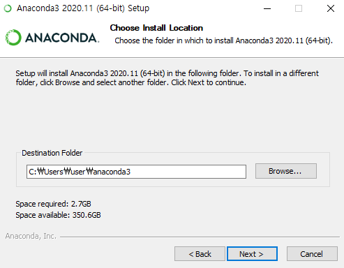
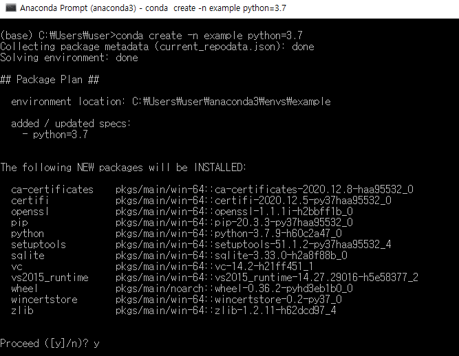
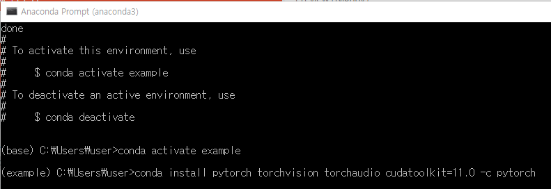
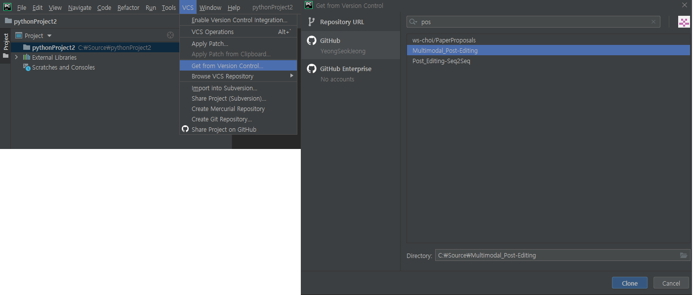
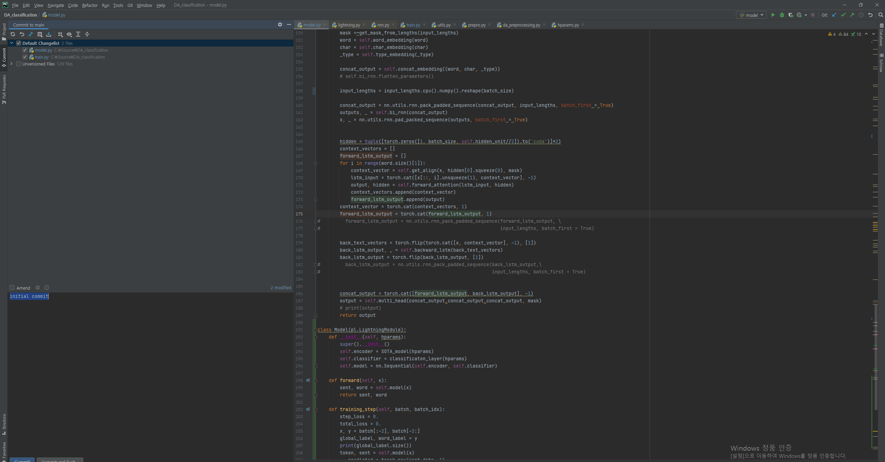
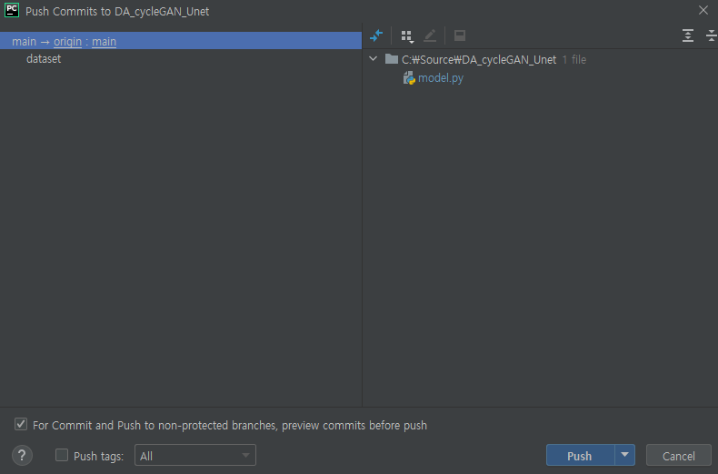
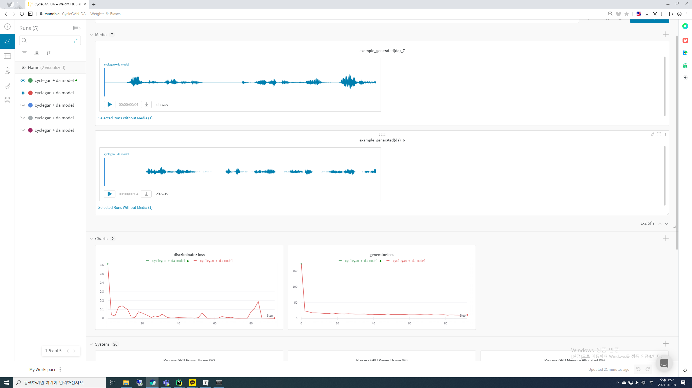

# Pycharm 사용 후기


## 설치 ... (anaconda & pycharm)

1. [anaconda 설치](https://https://www.anaconda.com/products/individual#Downloads)



2. anaconda 환경 구축 (pytorch 최신 버전을 받기 위해서는 python 3.7 이상 버전을 받아야합니다!!) 



3. pytorch 설치 (pytorch 설치전 CUDA 11.0 driver를 먼저 설치해야합니다!)




👏👏👏 !

1. [pycharm 설치](https://www.jetbrains.com/ko-kr/pycharm/download/#section=windows)


## GitㆍPycharm

1. git(VCS → get from version control --> github )

   

2. commit(ctrl + k)

   

3. push

   

## [Wandb](https://wandb.ai)

1. wandb 가입!!
2. wandb 설치

```
pip install wandb
pip install login

wandb: You can find your API key in your browser here: https://app.wandb.ai/authorize
wandb: Paste an API key from your profile and hit enter:
```

3. pytorch

   ```python
   import wandb
   wandb.init(project = 'project name')
   wandb.run.name = 'name'
   model = create_model(hparams)
   wandb.watch(model)
   
   for i, batch in enumerate(train_loader):
       train_loader = model(batch)
       ...
       loss = criterion(pred, label)
       if i % 50 == 0:
           wandb.log({'train_loss': loss})
   ```

4. wandb



