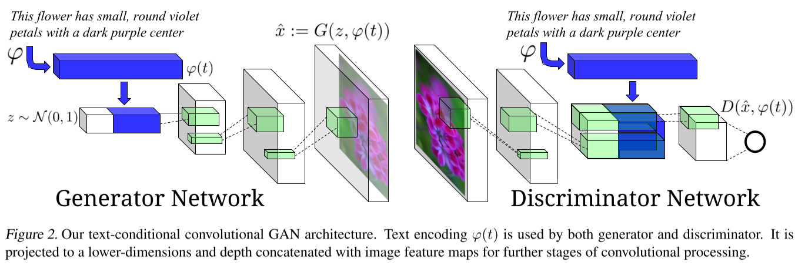
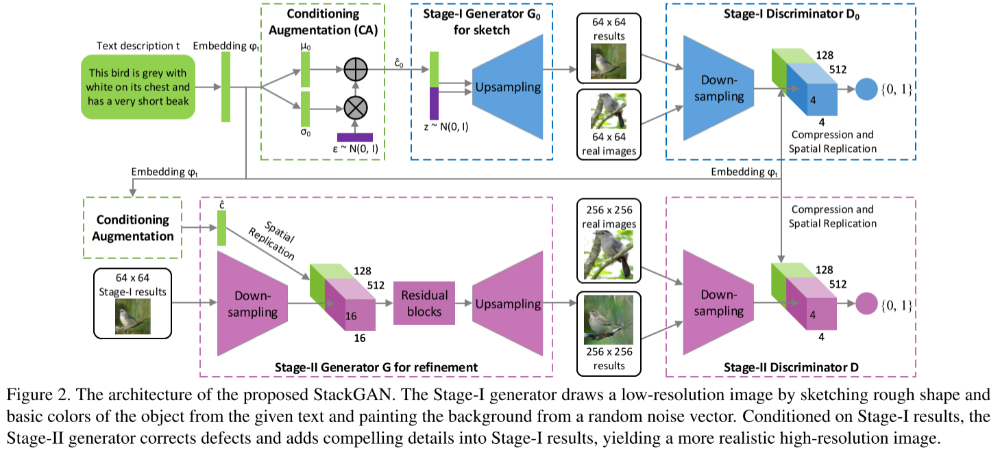
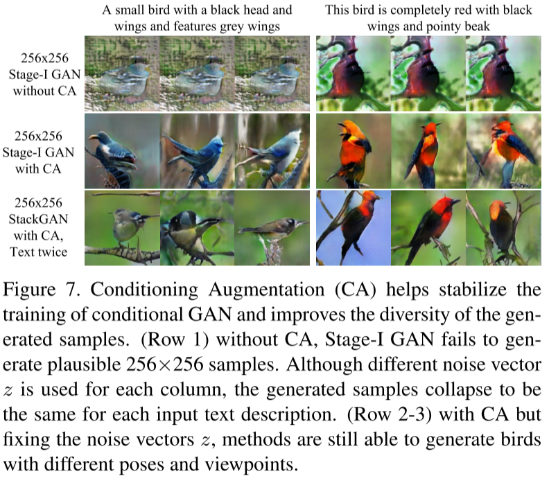
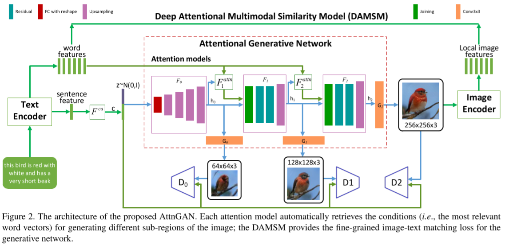
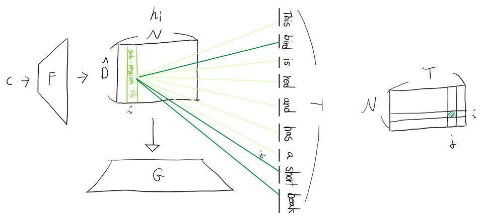
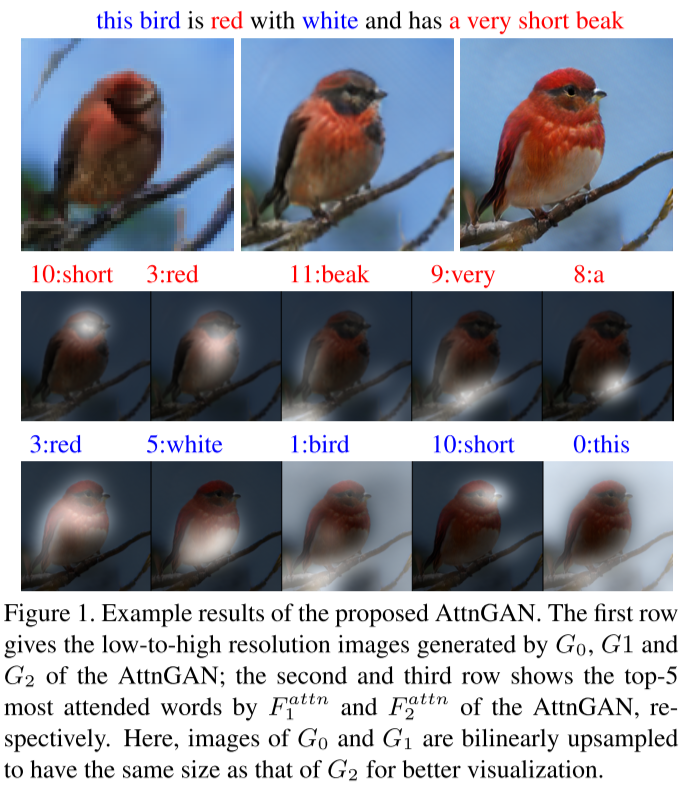
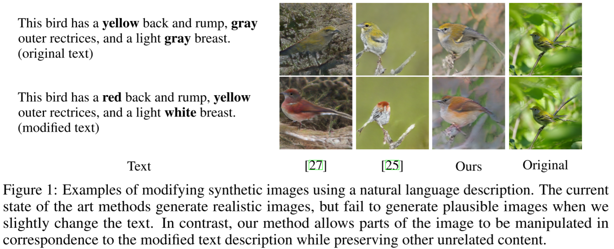

# A Survey of Text-Guided Image Generation

## : from cGAN to ManiGAN

### Woosung Choi

---

## Contents

1. Preliminaries
    - Generative Adversarial Network (GAN)  
    - Conditional GAN
2. Text-to-Image Generation
3. Advanced
    - Controllable Text-to-Image Generation
    - Text-Guided Image Manipulation
    - Bert-like System

---

## Preliminaries - GAN

- Generative Adversarial Network
  - Framework
    

  - Loss Function
   

---

## Preliminaries - cGAN

- Conditional Generative Adversarial Network

- Mino, Ajkel, and Gerasimos Spanakis. "LoGAN: Generating logos with a generative adversarial neural network conditioned on color." 2018 17th IEEE International Conference on Machine Learning and Applications (ICMLA). IEEE, 2018.

---

## Text-to-Image Generation

- **[ICML 2016]** Reed, Scott, et al. "Generative Adversarial Text to Image Synthesis." International Conference on Machine Learning. 2016.
- **[StackGAN]** Zhang, Han, et al. "Stackgan: Text to photo-realistic image synthesis with stacked generative adversarial networks." ICCV. 2017.
- **[AttnGAN]** Xu, Tao, et al. "Attngan: Fine-grained text to image generation with attentional generative adversarial networks." CVPR. 2018.
- **[ControlGAN]** Li, Bowen, et al. "Controllable text-to-image generation." Advances in Neural Information Processing Systems. 2019.

---

## Text-to-Image Generation: ICML 2016

- conditioning by concatenatiion
  - $\varphi$: text encoder
  - $\varphi(t)$: embedding of the text description $t$

---

## Text-to-Image Generation: StackGAN

- Motivation
  - [ICML 2016] can generate images that are highly related to the text, but it is very difficult to train GAN to generate ***high-resolution*** images from text
  - Simply adding more upsampling layers? : Empirically have failed

- Stacked Generative Adversarial Networks
  - State-I-GAN: sketches primitive shape and basic colors, ... (**coarse-grained**)
  - State-II-GAN: corrects defects, complete details (**fine-grained**)

- ***Conditioning Augmentation***
  - to stabilize conditional GAN training, and also improves the diversity of the generated samples

---

## Text-to-Image Generation: StackGAN - Overview

---

## Text-to-Image Generation: StackGAN - CA

### Conditioning Augmentation

- the text embedding is nonlinearly transformed to generate conditioning latent variables in [ICML 2016]

- However, latent space for the text embedding is usually high dimensional

- With limited amount of data, it usually causes discontinuity in the latent data manifold, which is not desirable

- To avoid overfitting, we add the regularization term to the objective function
  

---

## Text-to-Image Generation: StackGAN - Ablation Study for CA

---

## Text-to-Image Generation: AttnGAN

### Motivation

- Conditioning GAN only on the global sentence vector lacks important fine-grained information at the word level and prevents the generation of high-quality images
- This problem becomes even more severe when generating complex scenes

### AttnGAN

- To address this issue, AttnGAN allows attention-driven, multi-stage refinement for fine-grained text-to-image generation

---

## Text-to-Image Generation: AttnGAN - Overview

---

## Text-to-Image Generation: AttnGAN vs StackGAN

 

---

## Text-to-Image Generation: AttnGan - Attention

 

---

## Advanced

- Controllable Text-to-Image Generation
  - **[ControlGAN]** Li, Bowen, et al. "Controllable text-to-image generation." Advances in Neural Information Processing Systems. 2019.

- Text-Guided Image Manipulation
  - **[ManiGAN]** Li, Bowen, et al. "Manigan: Text-guided image manipulation." Proceedings of the IEEE/CVF Conference on Computer Vision and Pattern Recognition. 2020.

- Bert-like System
  - **[X-LXMERT]** Cho, Jaemin, Jiasen Lu, D. Schwenk, Hannaneh Hajishirzi and Aniruddha Kembhavi. “X-LXMERT: Paint, Caption and Answer Questions with Multi-Modal Transformers.”, EMNLP 2020

---

## Advanced 1: ControlGAN

- Input: a sentence $S$
- Output: a realistic image $I'$ that semantically aligns with $S$
- Constraints: we want to make this generation process ***controllable***
  - if $S$ is modified to be $S_m$,
  - the synthetic result $\tilde{I'}$ should semantically match $S_m$ while preserving irrelevant content existing in $I'$

    

---

## Advanced 2: ManiGAN

- Input: an input image $I$ and a text description $S'$
- Output: a realistic image $I'$ that is semantically aligned with $S$
- Constraints: preserving text-irrelevant contents existing in $I$

