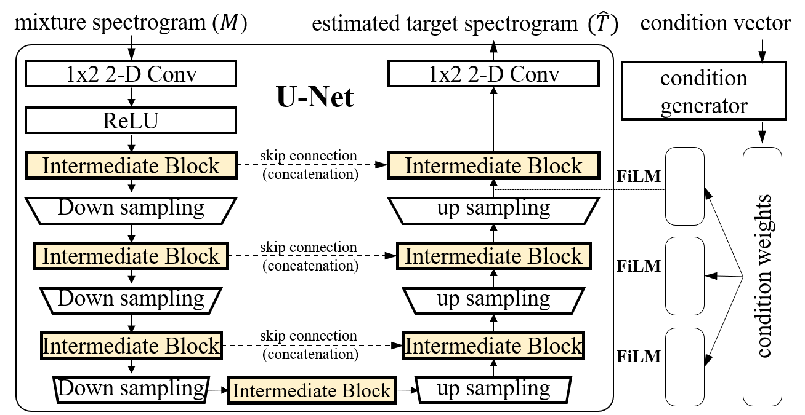
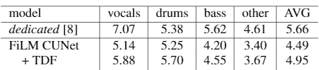
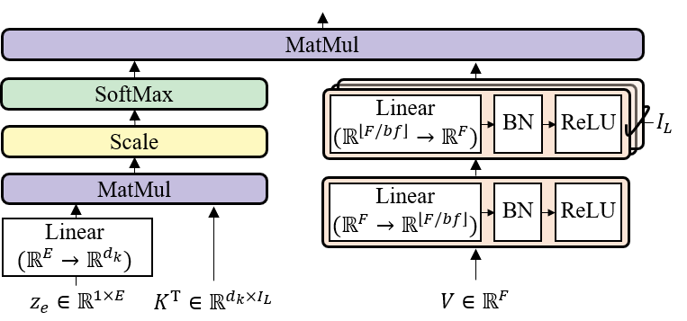
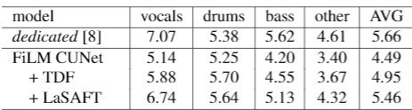
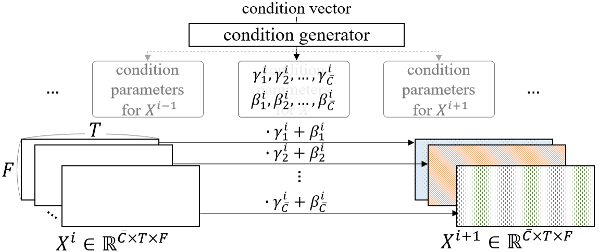
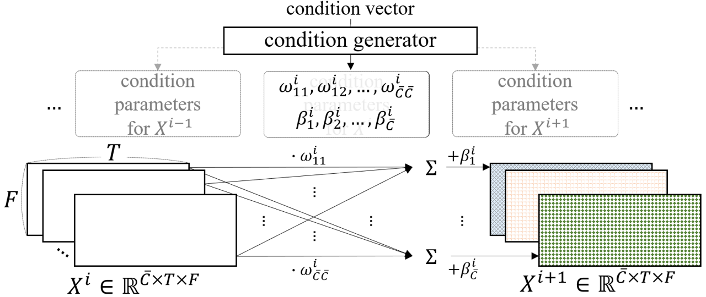
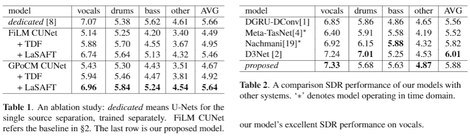
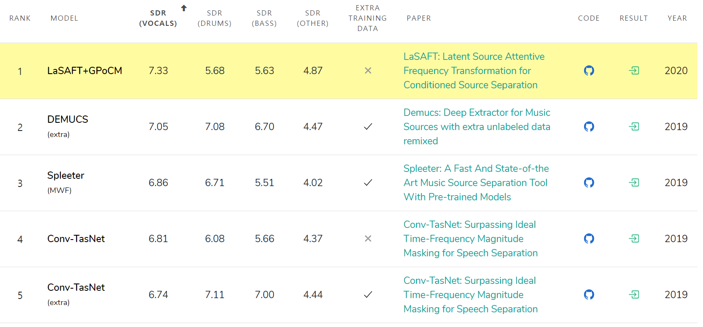

# LaSAFT: Latent Source Attentive Frequency Transformation for Conditioned Source Separation

### Woosung Choi, Minseok Kim, Jaehwa Chung, and Soonyoung Jung

#### Our code and models are available [online](https://github.com/ws-choi/Conditioned-Source-Separation-LaSAFT).

---

## Demonstrations: Conditioned Source Separation

 

Colab Demonstration - [Stella Jang's](https://colab.research.google.com/github/ws-choi/Conditioned-Source-Separation-LaSAFT/blob/main/colab_demo/LaSAFT_with_GPoCM_Stella_Jang_Example.ipynb), [Feel the breeze](https://colab.research.google.com/github/ws-choi/Conditioned-Source-Separation-LaSAFT/blob/main/colab_demo/LaSAFT_with_GPoCM_Feel_this_breeze.ipynb), [Other Examples](https://colab.research.google.com/github/ws-choi/Conditioned-Source-Separation-LaSAFT/blob/main/colab_demo/LaSAFT_with_GPoCM.ipynb)

Youtube Versions: [Stella Jang's](https://youtu.be/buWnt89kVzs), [Feel this breeze](https://youtu.be/64Un0dXa9aU), [Other Examples](https://youtu.be/2GEpxjCo1tI)

---

## Abstract

- Recent deep-learning approaches have shown that Frequency Transformation (FT) blocks can significantly improve spectrogram-based single-source separation models by capturing frequency patterns. 
- The goal of this paper is to extend the FT block to fit the multi-source task.
- We propose
  - Latent Source Attentive Frequency Transformation (LaSAFT) block to capture source-dependent frequency patterns. 
  - Gated Point-wise Convolutional Modulation (GPoCM), an extension of Feature-wise Linear Modulation (FiLM), to modulate internal features. 
- By employing these two novel methods, we extend the Conditioned-U-Net (CUNet) for multi-source separation, and the experimental results indicate that our LaSAFT and GPoCM can improve the CUNet's performance, achieving state-of-the-art SDR performance on several MUSDB18 source separation tasks.

---

## Preliminaries 1: Categries of Source separation models

- *Dedicated models*
  - Most of the deep learning-based models for Music Source Separation (MSS) are dedicated to a single instrument.
  - cons1: forces us to train an individual model for each instrument.
  - cons2: models cannot use the commonalities between different instruments.

- *Multi-head models*
  - Let's generate several outputs at once with multi-head.
  - Although it shows promising results, this approach still has a scaling issue: the number of heads increases as the number of instrument increases, leading 
    1. performance degradation caused by the shared bottleneck
    2. inefficient memory usage.

---

## Preliminaries 1: An alternative approach

- **Conditioning/Meta Learning**
  - can separate different instruments with the aid of the **control mechanism**. 
  - no shared bottleneck, no multi-head output layer

    

---

## Preliminaries 1: Conditioned Source Separation

- Task Definition
  - Input: an input audio track $A$ and a a one-hot encoding vector $C$ that specifies which instrument we want to separate
  - Output: separated track of the target instrumlent

---

## Preliminaries 1: Example - Conditioned U-Net

- Conditioned-U-Net extends the U-Net by exploiting Feature-wise Linear Modulation (FiLM)

  

---

## Preliminaries 2: Frequency Transformation Block

- Frequency patterns

  - Recent spectrogram-based methods for Singing Voice Separation (SVS) or Speech Enhancement (SE) employed Frequency Transformation (FT) blocks to capture ***frequency patterns***.
  - Although stacking 2-D convolutions has shown remarkable results, it is hard to capture long-range dependencies along the frequency axis for fully convolutional networks with small sizes of kernels. 
  - FT blocks, which have ***fully-connected layers*** applied in a time-distributed manner, are useful to this end.

  

---

## Preliminaries 2: Injecting FT blocks into U-Nets

- An FT block called Time-Distributed Fully-connected Layer (TDF): 
  

- TFC-TDF: SDR 6.75dB $\rightarrow$ 7.12dB in Singing Voice Separation

  

---

## Naive Extention: Injtecting FT blocks into C-U-Net?

- Baseline U-Net

  

- TFC vs TFC-TDF
  

---

## Naive Extention: Above our expectation

- TFC vs TFC-TDF
  

- Although it does improve SDR performance by capturing common frequency patterns observed across all instruments
- Merely injecting an FT block to a CUNet **does not inherit the spirit of FT block**

- In this paper, 
  - We propose the Latent Source-Attentive Frequency Transformation (LaSAFT), a novel frequency transformation block that can capture instrument-dependent frequency patterns by exploiting the scaled dot-product attention

---

## LaSAFT: Extending TDF to the Multi-Source Task (1)

- duplicate $\mathcal{I}_L$ copies of the second layer of the TDF,  where $\mathcal{I}_L$ refers to the number of ***latent instruments***.
  - $\mathcal{I}_L$ is not necessarily the same as $\mathcal{I}$ for the sake of flexibility
- For the given frame $V\in \mathbb{R}^F$, we obtain the $\mathcal{I}_L$ latent instrument-dependent frequency-to-frequency correlations, denoted by $V'\in \mathbb{R}^{F \times \mathcal{I}_L}$.

---

## LaSAFT: Extending TDF to the Multi-Source Task (2)

- The left side determines how much each ***latent source*** should be attended
- The LaSAFT takes as input  the instrument embedding $z_e \in \mathbb{R}^{1 \times E}$. 
- It has a learnable weight matrix $K\in \mathbb{R}^{ \mathcal{I}_L \times d_{k}}$, where we denote the dimension of each instrument's hidden representation by $d_{k}$.
- By applying a linear layer of size $d_{k}$ to $z_e$, we obtain $Q \in \mathbb{R}^{d_{k}}$.

---

## LaSAFT: Extending TDF to the Multi-Source Task (3)

- We now can compute the output of the LaSAFT as follows:

  - $Attention(Q,K,V') = softmax(\frac{QK^{T}}{\sqrt{d_{k}}})V'$

- We apply a LaSAFT after each TFC in the encoder and after each Film/GPoCM layer in the decoder. We employ a skip connection for LaSAFT and TDF, as in TFC-TDF.

---

## Effects of employing LaSAFTs instead of TFC-TDFs

---

## GPoCM: FiLM is also not enough

- Feature-wise Linear Modulation (FiLM)
  

- Point-wise Conolutional Modulation (PoCM)
  
---

## GPoCM: PoCM

- PoCM is an extension of FiLM. While FiLM does not have inter-channel operations

  - $FiLM(X^{i}_{c}|\gamma_{c}^{i},\beta_{c}^{i}) =  \gamma_{c}^{i} \cdot X^{i}_{c} + \beta_{c}^{i}$

  - $PoCM(X^{i}_{c}|\omega_{c}^{i},\beta_{c}^{i}) = \beta_{c}^{i} + \sum_{j}{\omega_{cj}^{i} \cdot X^{i}_{j}}$
    - where $\gamma_{c}^{i}$ and $\beta_{c}^{i}$ are parameters generated by the condition generator, and $X^{i}$ is the output of the $i^{th}$ decoder's intermediate block, whose subscript refers to the $c^{th}$ channel of $X$

    

---

## GPoCM: Gated PoCM

- Since this channel-wise linear combination can also be viewed as a point-wise convolution, we name it as PoCM. With inter-channel operations, PoCM can modulate features more flexibly and expressively than FiLM.

- Instaed of PoCM, we use Gated PoCM (GPoCM), since GPoCN is robust for source separation task. It is natural to use ***gated*** apporach the source separation tasks becuase a sparse latent vector (that contains many near-zero elements) obtained by applying GPoCMs, naturally generates separated result (i.e. more silent than the original).
- $GPoCM(X^{i}_{c}|\omega_{c}^{i},\beta_{c}^{i}) = \sigma(PoCM(X^{i}_{c}|\omega_{c}^{i},\beta_{c}^{i})) \odot X^{i}_{c}$
  - where $\sigma$ is a sigmoid and $\odot$ means the Hadamard product. 

---

## Experimental Results

---

## LaSAFT + GPoCM

- acheived [state-of-the-art](https://paperswithcode.com/sota/music-source-separation-on-musdb18?p=lasaft-latent-source-attentive-frequency) SDR performance on vocals and other task in Musdb18.

---

## Discussion

- The authors of cunet tried to manipulate latent space in the encoder, 
  - assuming the decoder can perform as a general spectrogram generator, which is `shared' by different sources.

- However, we found that this approach is not practical since it makes the latent space (i.e., the decoder's input feature space) more discontinuous. 

- Via preliminary experiments, we observed that applying FiLMs in the decoder was consistently better than applying FilMs in the encoder.
