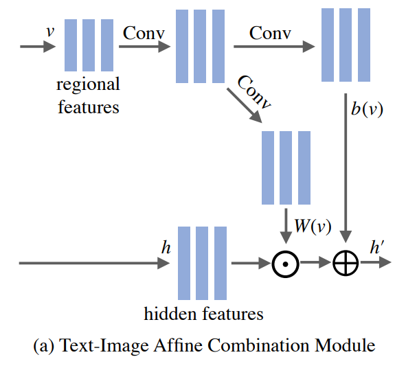

# ManiGAN

### Woosung Choi

---

## Abstract

- Goal of this paper
  - semantically edit parts of an image to match a given text that describes desired attributes (e.g., texture, colour, and background), 
  - while preserving other contents that are irrelevant to the text
- ManiGAN contains two key components: ACM and DCM
- A new metric for evaluating image manipulation results
  - in terms of both the generation of new attributes
  - and the reconstruction of text-irrelevant contents. 

- Experimental Results on the CUB and COCO datasets
  - demonstrate the superior performance of the proposed method.

---

## Key Components

- ACM
  - selects image regions relevant to the given text 
  - and then correlates the regions with corresponding semantic words for effective manipulation
  - Meanwhile, it encodes original image features to help reconstruct text-irrelevant contents. 


- DCM
  - rectifies mismatched attributes
  - and completes missing contents of the synthetic image

---

## Architecture

- basic framework: multi-stage ControlGAN
  - pre-trained bi-directional RNN
    - encodes $S$ to a sentence feature $s\in\mathbb{R}^D$, and word features $w\in\mathbb{R}^{D\times L}$
    - obtains $\tilde{s}$ by applying Conditioning Augmentation (CA) to $s$
    - 그담에 z곱하는데? 
    - $\sim$ VAE-like latent vector
    - 


---

## Text-Guided Image Manipulation

- Input: an input image $I$ and a text description $S'$
- Output: a realistic image $I'$ that is semantically aligned with $S'$
- Constraints: preserving text-irrelevant contents existing in $I$


---

##  ACM: Text-Image Affine Combination Module

```python
# The implementation of ACM (affine combination module)
class ACM(nn.Module): 
    def __init__(self, channel_num):
        super(ACM, self).__init__()
        self.conv = conv3x3(cfg.GAN.GF_DIM, 128)
        self.conv_weight = conv3x3(128, channel_num)    # weight
        self.conv_bias = conv3x3(128, channel_num)      # bias

    def forward(self, h, v):
        out_code = self.conv(v)
        out_code_weight = self.conv_weight(out_code)
        out_code_bias = self.conv_bias(out_code)
        return h * out_code_weight + out_code_bias
```

- $h'=h\odot W(v) + b(v)$
  - $h \in \mathbb{R}^{C\times H \times D}$, $v \in \mathbb{R}^{256\times 17 \times 17}$
- ACM $\approx$ PoCM 


---

## ACM: Figure



---

