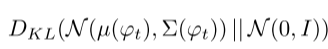
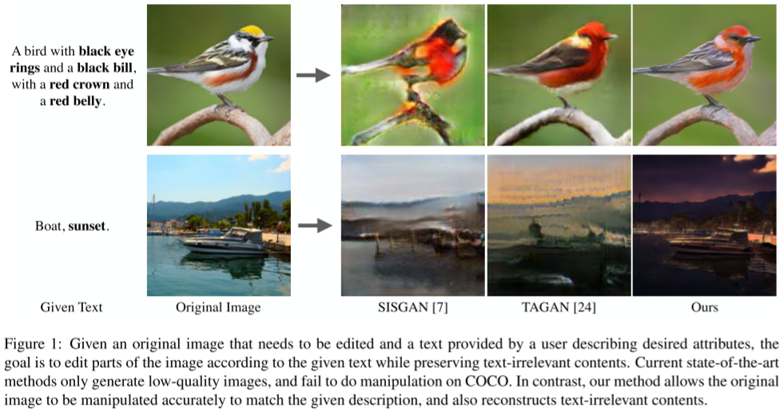
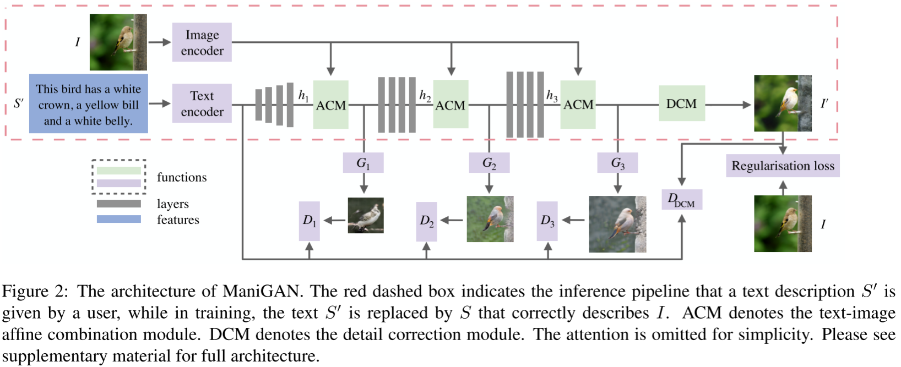
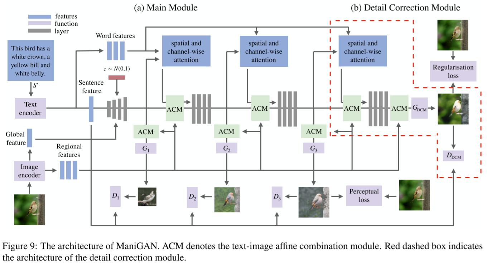
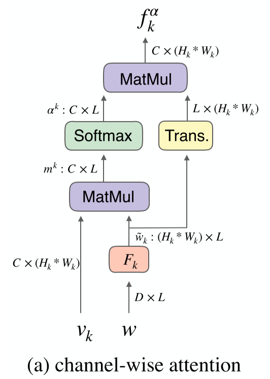
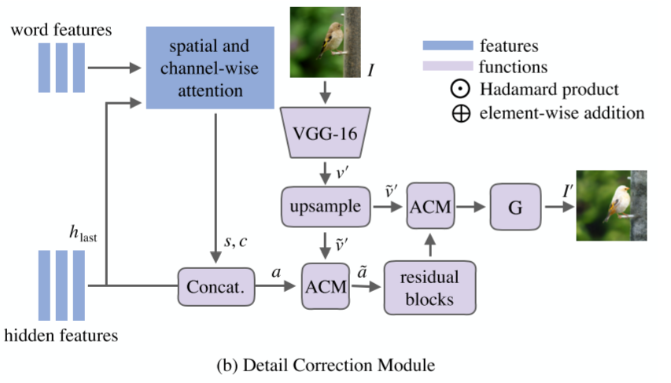

# ManiGAN

### Woosung Choi

---


## Text-to-Image Generation

- **[ICML 2016]** Reed, Scott, et al. "Generative Adversarial Text to Image Synthesis." International Conference on Machine Learning. 2016.
- **[StackGAN]** Zhang, Han, et al. "Stackgan: Text to photo-realistic image synthesis with stacked generative adversarial networks." ICCV. 2017.
- **[AttnGAN]** Xu, Tao, et al. "Attngan: Fine-grained text to image generation with attentional generative adversarial networks." CVPR. 2018.
- **[ControlGAN]** Li, Bowen, et al. "Controllable text-to-image generation." Advances in Neural Information Processing Systems. 2019.

---

## Text-to-Image Generation: ICML 2016


- conditioning by concatenatiion
  - $\varphi$: text encoder
  - $\varphi(t)$: embedding of the text description $t$

---

## Text-to-Image Generation: StackGAN

- Motivation
  - [ICML 2016] can generate images that are highly related to the text, but it is very difficult to train GAN to generate ***high-resolution*** images from text
  - Simply adding more upsampling layers? : Empirically have failed

- Stacked Generative Adversarial Networks
  - State-I-GAN: sketches primitive shape and basic colors, ... (**coarse-grained**)
  - State-II-GAN: corrects defects, complete details (**fine-grained**)

- ***Conditioning Augmentation***
  - to stabilize conditional GAN training, and also improves the diversity of the generated samples

---

## Text-to-Image Generation: StackGAN - Overview


---

## Text-to-Image Generation: StackGAN - CA

### Conditioning Augmentation

- the text embedding is nonlinearly transformed to generate conditioning latent variables in [ICML 2016]

- However, latent space for the text embedding is usually high dimensional

- With limited amount of data, it usually causes discontinuity in the latent data manifold, which is not desirable

- To avoid overfitting, we add the regularization term to the objective function
  

---

## Text-to-Image Generation: StackGAN - Ablation Study for CA


---

## Text-to-Image Generation: AttnGAN

### Motivation

- Conditioning GAN only on the global sentence vector lacks important fine-grained information at the word level and prevents the generation of high-quality images
- This problem becomes even more severe when generating complex scenes

### AttnGAN

- To address this issue, AttnGAN allows attention-driven, multi-stage refinement for fine-grained text-to-image generation

---

## Text-to-Image Generation: AttnGAN - Overview


---

## Text-to-Image Generation: AttnGAN vs StackGAN

 

---

## Spatial Attention (Original)

1. calculate similarity matrix for all possible pairs of words <-> sub-regions by
    - $s = e^{T}v$
      - $s \in \mathbb{R}^{L \times 289}$
      - $e \in \mathbb{R}^{D \times L}$, $v \in \mathbb{R}^{D \times 289}$
    - $s_{i,j}$ is the dot-product similarity: the ith word <-> the jth sub-region
2. compute normalized similarity $\bar{s}_{i,j}=\frac{exp(s_{i,j})}{\sum_{l=0}^{L-1}exp(s_{l,j})}$
3. compute region-context vector $c_i$, a dynamic representation of the images's sub-regions related to the $i^{th}$ word of the sentence
    - $c_{i}=\sum_{j=0}^{288}{\alpha_{j}v_{j}}$, where $\alpha_{j}=\frac{exp(\gamma_{1}\bar{s}_{i,j})}{\sum_{k=0}^{288}exp(\gamma_{1}\bar{s}_{i,k})}$
      - set $\gamma_{1}$ to be 1, for the sake of simplicity


---

## Advanced

- Controllable Text-to-Image Generation
  - **[ControlGAN]** Li, Bowen, et al. "Controllable text-to-image generation." Advances in Neural Information Processing Systems. 2019.

- Text-Guided Image Manipulation
  - **[ManiGAN]** Li, Bowen, et al. "Manigan: Text-guided image manipulation." Proceedings of the IEEE/CVF Conference on Computer Vision and Pattern Recognition. 2020.


---

## Abstract

- Goal of this paper
  - semantically edit parts of an image to match a given text that describes desired attributes (e.g., texture, colour, and background), 
  - while preserving other contents that are irrelevant to the text
- ManiGAN contains two key components: ACM and DCM
- A new metric for evaluating image manipulation results
  - in terms of both the generation of new attributes
  - and the reconstruction of text-irrelevant contents. 

- Experimental Results on the CUB and COCO datasets
  - demonstrate the superior performance of the proposed method.

---

## Text-Guided Image Manipulation

- Input: an input image $I$ and a text description $S'$
- Output: a realistic image $I'$ that is semantically aligned with $S'$
- Constraints: preserving text-irrelevant contents existing in $I$



---

## Key Components

- ACM
  - selects image regions relevant to the given text 
  - and then correlates the regions with corresponding semantic words for effective manipulation
  - Meanwhile, it encodes original image features to help reconstruct text-irrelevant contents. 


- DCM
  - rectifies mismatched attributes
  - and completes missing contents of the synthetic image

- Channel-wise Attention
- Spatial Attention
---

## Overall Architecture (simple)



---

## Overall Architecture



---

##  ACM: Text-Image Affine Combination Module

```python
# The implementation of ACM (affine combination module)
class ACM(nn.Module): 
    def __init__(self, channel_num):
        super(ACM, self).__init__()
        self.conv = conv3x3(cfg.GAN.GF_DIM, 128)
        self.conv_weight = conv3x3(128, channel_num)    # weight
        self.conv_bias = conv3x3(128, channel_num)      # bias

    def forward(self, h, v):
        out_code = self.conv(v)
        out_code_weight = self.conv_weight(out_code)
        out_code_bias = self.conv_bias(out_code)
        return h * out_code_weight + out_code_bias
```

- $h'=h\odot W(v) + b(v)$
  - $h \in \mathbb{R}^{C\times H \times D}$, $v \in \mathbb{R}^{256\times 17 \times 17}$
- ACM $\approx$ PoCM


---

## ACM: Figure


---

## Chnnel-wise Attention

- $ChannelAttention(w,v_{k})=f_{k}^{\alpha}\in\mathbb{R}^{C\times (H_k \cdot W_k)}$
  - input: word features $w\in\mathbb{R}^{D\times L}$ and hidden visual features $v_{k} \in \mathbb{R}^{C \times (H_k \cdot W_k)}$ 
  - where $H_k$ and $W_k$ denote the height and width at stage k. 

---

## Channel-wise Attention

- The channel-wise attention module at the $k^{th}$ stage
  1. input: word features $w\in\mathbb{R}^{D\times L}$ and hidden visual features $v_{k} \in \mathbb{R}^{C \times (H_k \cdot W_k)}$ 
      - , where $H_k$ and $W_k$ denote the height and width at stage k. 
  2. compute $\tilde{w_{k}} = F_{k}w$, where $F_k$ is an embedding layer ($D \rightarrow (H_k \cdot W_k)$)
      - $w$ are first mapped into the same semantic space as the visual features $v_k$
      - producing $\tilde{w_{k}} = F_{k}w$, where $F_{k} \in \mathbb{R}^{ (H_k \cdot W_k) \times D}$
  3. compute channel-word correlation matrix $m^{k} \in \mathbb{R}^{C \times L}$   
      - $m^{k} = v_{k} \tilde{w_{k}}$
        - $[C,L] = [C$, $(H_k \cdot W_k)] \times [(H_k \cdot W_k), L]$
      - m^k$ aggregates correlation values between channels and words across all spatial locations.

---

## Channel-wise Attention (2)

- The channel-wise attention module at the $k^{th}$ stage
  1. input: word features $w\in\mathbb{R}^{D\times L}$ and hidden visual  
  2. compute $\tilde{w_{k}} = F_{k}w$, where $F_k$ is a word perception layer
  3. compute channel-word correlation matrix $m^{k} \in \mathbb{R}^{C \times L}$
  4. compute attention weight $\alpha^{k}_{i,j}=\frac{exp(m^{k}_{i,j})}{\sum_{l=0}^{L-1}exp(m^{k}_{i,l})}$
      - $\alpha^{k}_{i,j}$ is the correlation between $i^{th}$ channel in  $v_k$ and the $j^{th}$ word in $S$
      - higher value, larger correlation
  5. obtain final channel-wise attention feature $f_{k}^{\alpha}\in\mathbb{R}^{C\times (H_k \cdot W_k)}$
      - $f_{k}^{\alpha}=\alpha^{k}(\tilde{w_{k}})^T$
        - $[C,(H_k \cdot W_k)] = [C,L] \times [L, (H_k \cdot W_k)]$

---

## Channel-wise Attention: Code

```python
class ChannelAttention(nn.Module):
    def __init__(self, idf, cdf):
        super(ChannelAttention, self).__init__()
        self.conv_context2 = conv1x1(cdf, 64*64)
        self.conv_context3 = conv1x1(cdf, 128*128)
        self.sm = nn.Softmax()
        self.idf = idf

    def forward(self, v_k, w, ih, iw):

        batch_size, L = w.size(0), w.size(2)
        w_tilde = w.unsqueeze(3)

        if (ih == 64):
            w_tilde = self.conv_context2(w_tilde).squeeze(3) 
        else:
            w_tilde = self.conv_context3(w_tilde).squeeze(3) 

        attn_c = torch.bmm(v_k, w_tilde)
        attn_c = attn_c.view(batch_size * self.idf, L)
        attn_c = self.sm(attn_c)
        attn_c = attn_c.view(batch_size, self.idf, L)
        
        attn_c = torch.transpose(attn_c, 1, 2).contiguous()

        fk = torch.bmm(w_tilde, attn_c)
        fk = torch.transpose(fk, 1, 2).contiguous()
        fk = fk.view(batch_size, -1, ih, iw)

        return fk, attn_c
```

--- 

## Channel-wise Attention: Figure



---

## Detail Correction Module (DCM)

- enhance the details and complete missing contents in the synthetic image
  - $\approx$ skip connections in U-Nets
- input: last hidden features $h_{last}$ from last ACM, word features $w\in \mathbb{R}^{D \times L}$, and VGG-feature of the original image $I$  



---

## Spatial Attention in MagiGAN


1. input: word features $w\in\mathbb{R}^{D\times L}$ and hidden visual features $h_{k} \in \mathbb{R}^{C \times (H_k \cdot W_k)}$ 
    - , where $H_k$ and $W_k$ denote the height and width at stage k. 
2. compute $\tilde{w_{k}} = E_{k}w$, where $E_k$ is an embedding layer ($D \rightarrow C$)
    - $w$ are first mapped into the same semantic space as the visual features $v_k$
    - producing $\tilde{w_{k}} = E_{k}w$, where $E_{k} \in \mathbb{R}^{ C \times D}$
3. $attn= softmax(h_{k}\tilde{w})$
4. compute $v_{k}=\tilde{w} (attn)^{T}$

---

## Spatial Attention: Figure


---

## Spatial Attention: code

```python
class SpatialAttentionGeneral(nn.Module):
    def __init__(self, idf, cdf):
        super(SpatialAttentionGeneral, self).__init__()
        self.conv_context = conv1x1(cdf, idf)
        self.idf = idf

    def forward(self, h_k, w):

        batch_size, idf, ih, iw = h_k.shape
        batch_size, D, L = w.shape

        h_k = h_k.view(batch_size, -1, ih * iw).transpose(-1, -2).contiguous()
        w_tilde = self.conv_context(w.unsqueeze(3)).squeeze(3)
        # => h_k = [batch_size, ih * iw, idf], w_tilde = [batch_size, idf, L]

        # Get attention
        attn = torch.bmm(h_k, w_tilde).softmax(-1) # [batch_size, id * iw, L]
        attn = torch.transpose(attn, -1, -2).contiguous()
        # => attn = [batch_size, L,  id * iw]

        v_k = torch.bmm(w_tilde, attn) # [batch_size, idf, id*iw] 
        attn = attn.view(batch_size, -1, ih, iw)

        return v_k, attn
```
---

## Overall Architecture: review


