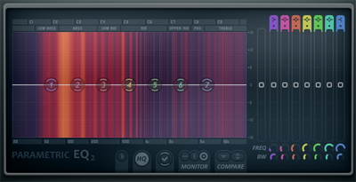
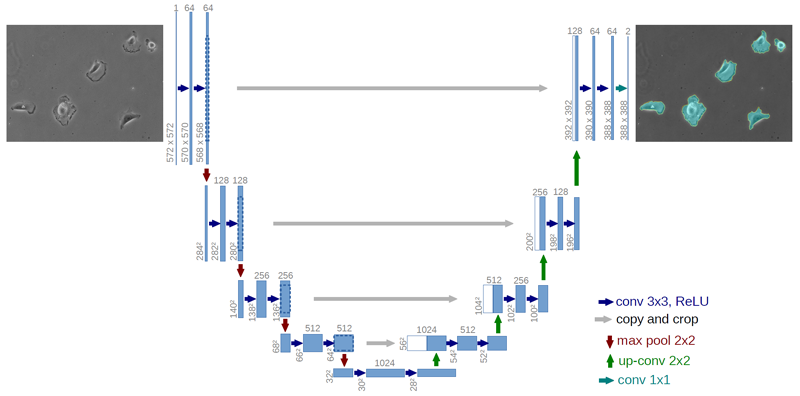
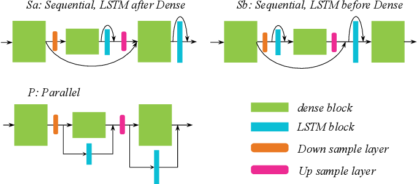
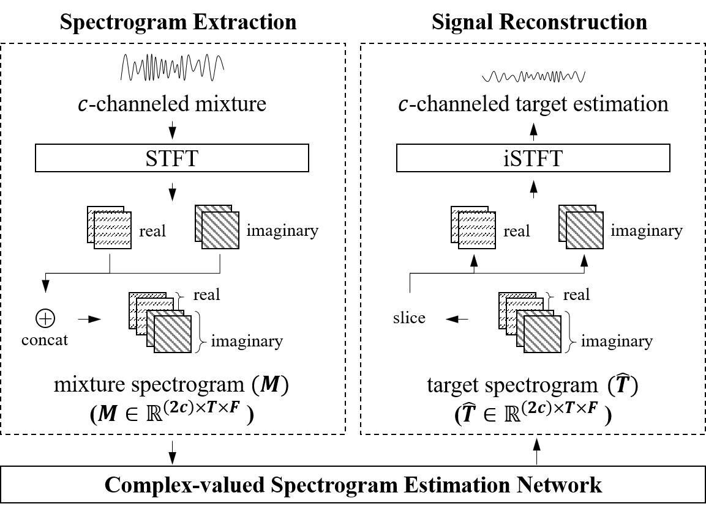
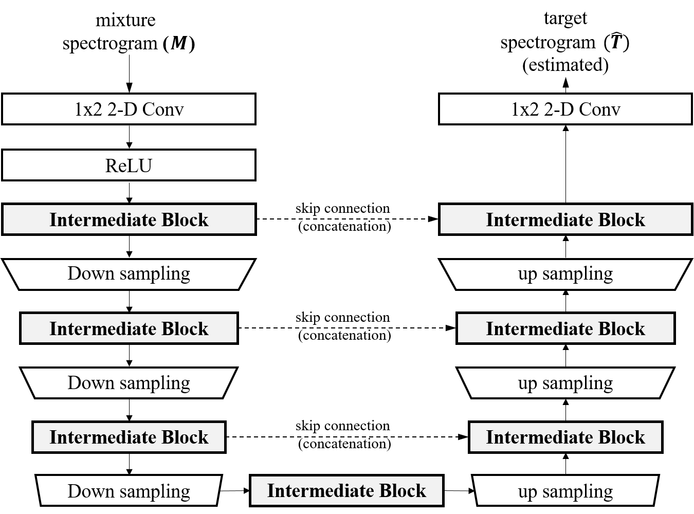
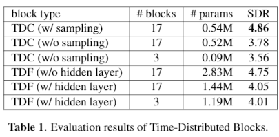
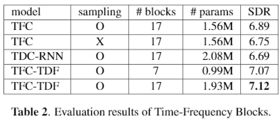
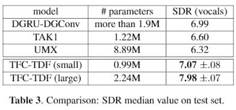
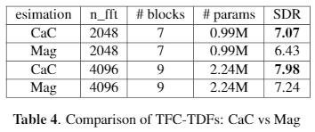

# Investigating U-Nets with various Intermediate Blocks for Spectrogram-based Singing Voice Separation

#### Woosung Choi, Minseok Kim, Jaehwa Chung, Daewon Lee, and Soonyoung Jung

##### The 21st International Society for Music Information Retrieval (ISMIR) Conference 11–15 OCTOBER 2020 VIRTUAL CONFERENCE

###### Our code and models are available [online](https://github.com/ws-choi/ISMIR2020\_U\_Nets\_SVS).

---

## Abstract

- Singing Voice Separation (SVS) tries to separate singing voice from a given mixed musical signal.
  - Recently, many U-Net-based models have been proposed for the SVS task,
  - but there were no existing works that evaluate and compare various types of intermediate blocks that can be used in the U-Net architecture.
- In this paper,
  - We introduce a variety of intermediate spectrogram transformation blocks.
  - We implement U-nets based on these blocks and train them on complex-valued spectrograms to consider both magnitude and phase.
  - These networks are then compared on the SDR metric. 
- When using a particular block composed of convolutional and fully-connected layers, it achieves state-of-the-art SDR on the MUSDB singing voice separation task by a large margin of 0.9 dB.

---

## Bacground

### Singing Voice Separation (SVS)

- a special case of Music Source Separation (MSS)
- aims at separating singing voice from a given mixed musical signal.

### Related Works

- Roughly categorized into two groups
  - waveform-to-waveform models: tries to generate the vocal waveforms directly 
  - **spectrogram-based models**: estimates spectrograms (usually magnitude) of vocal waveforms.

---

## Spectrogram-based models

- Audio Equalizer - Eliminate signals with unwanted frequencies

- [Procedure](http://localhost:8888/notebooks/seminar/2020-09-04-wschoi-ISMIR2020/jupyters/2020-09-04-wschoi-Spectrogram-based-Model.ipynb)
  1. Apply Short-Time Fourier Transform (STFT) on a mixture waveform to obtain the input spectrograms.
  2. Estimate the vocal spectrograms based on these inputs 
  3. Restore the vocal waveform with inverse STFT (iSTFT).

---

## Related Works: U-Net-based SVS Models

- U-Net[2]: an encoder-decoder structure with symmetric skip connections
  - These symmetric skip connections allow models to recover fine-grained details of the target object during decoding effectively.
  

- U-Net-like Models for SVS (or MSS) [1, 3-6]
  - They have revealed that U-Net-like architectures can provide promising performance for SVS and MSS.

---

## Related Works: Intermediate blocks

- Existing works proposed various types of neural networks for intermediate blocks.
  - Some models used simple **Convolutional Neural Networks (CNNs)** 
  - Other advanced models tried more **complex intermediate blocks**.

- MMDenseLSTM [6]

---

## Motivation

- No existing works that evaluate and directly compare these different types of blocks

- We conduct a comparative study of U-Nets on various intermediate blocks.

- We validate hypotheses such as that inserting time-distributed operations into intermediate blocks can significantly improve performance

---

## The scope of this paper

1. We designed several types of blocks based on different design strategies
2. For each type of block, we implemented at least one SVS model, which are all based on an identical U-Net framework for fair comparisons
3. we summarize the experimental results and discuss the effect of each design choice

---

## Contents

1. U-Net-based SVS Framework
    - We describe a U-Net-based SVS framework, which is shared by several models

2. Intermediate Blocks
    - We  present  several  types  of  intermediate  blocks  basedon  different  design  strategies

3. Experiment
    - We compare the performance of models

---

## 1. U-Net-based SVS Framework

1. Complex as Channel Framework
    

2. U-Net Architecture for Spectrogram Estimation

---

## 1. U-Net-based SVS Framework

1. Complex as Channel Framework

2. U-Net Architecture for Spectrogram Estimation
    

---

## 2. [Intermediate Blocks](https://github.com/ws-choi/ISMIR2020_U_Nets_SVS/blob/master/paper_with_code/Paper%20with%20Code%20-%203.%20INTERMEDIATE%20BLOCKS.ipynb)

1. Time-Distributed Blocks
    - Time-Distributed Fully-connected networks (TDF)
    - Time-Distributed Convolutions (TDC)

2. Time-Frequency Blocks
    - Time-Frequency Convolutions (TFC)
    - Time-Frequency Convolutions with TDF (TFC-TDF)
    - Time-Distributed Convolutions with RNNs (TDC-RNN)

---

## 3. Experiment

1. Dataset: [Musdb18](https://sigsep.github.io/datasets/musdb.html)
    - The train and test sets of MUSDB have 100 and 50 musical tracks each, all stereo and sampled at 44100 Hz.
    - Each track file consists of the mixture and its four source audios
    - Since we are evaluating on singing voice separation, we only use the `vocals' source audio as the separation target for each mixture track

2. Model Configurations
    - Each model is based on the U-Net architecture on the CaC framework
    - We set $c_{in}^{(1)}$, the number of internal channels to be 24
    - Each model uses a single type of block for its intermediate blocks.
    - We usually used an FFT window size of 2048 and a hop size of 1024 for STFT

---

## 3. Experiment: Training and Evaluation

- Training
  - Optimizer - RMSprop with learning rate $lr \in [0.0005, 0.0001]$
  - Loss function - Mean Squared Error
  - Data Augmentation [20]
    - linear mixture of audio clips from different tracks
- Evaluation
  - Evaluation Tool: [official evaluation tool](https://github.com/sigsep/sigsep-mus-e) of the SiSEC2018
  - measure SDR (Source Distortion Ratio)
    - we report the average of `median SDR values' over three runs for each model

---

## 3. Experimental Result (1)

---

## 3. Experimental Result (2)

---

## 4. Discussion: Developing Reusable Insights

- Our work provides a practical guideline for choosing  fundamental building blocks to develop an SVS or MSS model based on the U-Net architecture as follows.
  - TDC-based models are sensitive to the number of blocks, compared to TDF-based models.
  - Using down/up-sampling is important for CNN-based blocks, especially in the frequency dimension. 
  - Stacking 2-D CNNs is a simple but effective way to capture T and F features, compared to TDC-RNNs. 
  - Injecting a time-distributed block to a time-frequency block can improve SDR. 
  - A simple extension from a magnitude-only U-Net to a CaC U-Net can improve SDR. 

---

## 4. Discussion: Developing Reusable Insights (2)

- Our work is not limited to the U-Net-architecture nor MSS. 
- Blocks can be used as core components in more complex architectures as well. We can use different types of blocks for a single model, meaning that a lot of space remains for improvement.
- Also, our observations can be exploited in other MIR tasks such as Automatic Music Transcription (AMT) or Music Generation
  - for example, we expect that injecting TDFs to intermediate blocks for $f_0$ estimation model can improve performance since fully-connected layer can efficiently model long-range correlations such as harmonics
