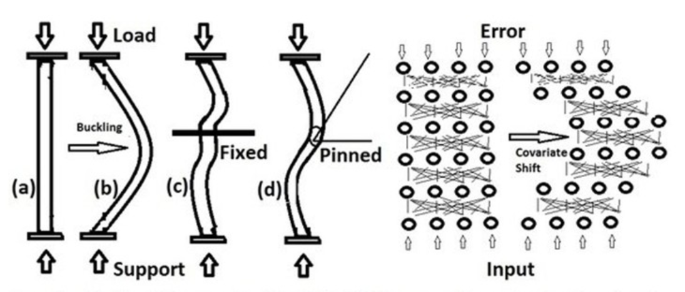

### <center>Batch Normalization<center>

> Author : nemo<br>2020-07-21

#### Contents

이 글은 [Batch Normalization: Accelerating Deep Network Training b y Reducing Internal Covariate Shift](https://arxiv.org/pdf/1502.03167.pdf)와 [삽화의 원작자가 답변한 Quora의 게시글](https://www.quora.com/Why-does-batch-normalization-help)과  [How Does Batch Normalization Help Optimization?](https://arxiv.org/pdf/1805.11604.pdf)을 읽고, Multi Layer Neural Network의 각 레이어의 입력을 정규화하는 기법인 Batch Normalization에 관한 내용을 정리하는 글이다. 입력을 정규화하면 각 층의 출력이 안정적이므로 Initialization에 덜 민감해지며, Gradient가 0이되거나 발산하는 문제를 해결하여 학습 속도와 정확성이 향상된다. 끝으로 cs231n 강의의 과제를 진행하며 작성한 코드를 통해 동작을 이해하는 문단을 포함하고 있다.

---

#### 1. Batch Normalization 배경

선형 함수만을 이용해 Neural Net을 작성하면 정규화는 필요하지 않다. W와 b를 수정하면 같은 결과를 얻을 수 있다. 반면, 비선형 함수의 경우 다수의 중간층을 지나며 입력의 분포를 유지하지 못하게 되며 이러한 현상을 Internal Covariate Shift라고 한다. [1] 중간층을 지날수록 입력분포가 변화해 Gradient가 0과 같은 값으로 치우칠 확률이 높아지며, 학습능력과 정확도를 잃게 되는데, Normalization은 이러한 문제를 막기 위해 입력의 분포를 정규화하는 것이다.

 

<center>Internal Covriate Shift에 관한 사진 [3]</center>

한편, 단순히 Normalization하면 일부 정보를 잃어버릴 수도 있다. 예를 들어 Bias에 대한 정보가 사라지거나, Sigmoid 활성함수의 입력을 정규화하면 함수의 선형적인 부분으로 범위가 제한되는 등의 문제가 있다. 따라서 Scale과 Shift를 학습할 수 있는 Parameter ($\gamma, \beta$)를 학습해야 한다. 나아가 Forward 과정에 관여하는 변수가 Back Propagation에 끼치는 영향을 증가시키기 위해 mini-batch를 구성하여 각 배치에 대한 이동평균 및 분산을 이용하는데, 이러한 방식을 Batch Normalization이라 한다.


#### 2. Batch Normalization

##### 2.1. Batch Normalization

train 과정 중간중간(보통 비선형 함수의 입력)에 Normalization을 적용해 평균과 분산을 Normalization한다. 각 mini-batch 별로 아래와 같은 계산을 진행한다.

$\mu=\frac{1}{N}\sum_{k=1}^{N}x_{k}$<br>$v=\frac{1}{N}\sum_{k=1}^{N}(x_{k}-\mu)^{2}$<br>$\sigma=\sqrt{v+\epsilon}$<br>$y_{i}=\frac{x_{i}-\mu}{\sigma}$

주로 비선형적인 활성함수의 앞쪽에 배치되어 활성함수에 들어오는 입력의 분포를 안정화시킨다.

아래의 그림에서 확인할 수 있듯이, 각 데이터를 Feature-wise로 Nomalization하는 것도 특징이다. 이는 CNN 등에서 Spartial Information을 그대로 전달할 수 있게끔 한다.


전체 데이터가 아닌 mini-batch에 대해서만 Normalization을 진행하면, 한 Iteration에서 사용된 Mini-Batch에 관한 데이터만 Back Propagation에 작용하게 되며, 평균과 분산을 계산하는 과정이 신경망 안에 포함되기 때문에, Batch Normalization과 관련된 Parameter의 학습이 가능해져서 유리하다.

Batch Normalization는 아래와 같은 특징을 지닌다고 알려져있다. [1] [3]

>1. Parameter의 Scale에 영향받지 않는다.<br>Weight에 스칼라로 된 가중치가 곱해져 있어도, 표준편차로 나누는 과정에서 상쇄되며, 오히려 Gradient는 $\frac{1}{a}$배로 작아지므로 Parameter의 수정이 보다 안정적이다.
>2. 큰 Learning Rate 사용 가능<br>일반적으로 학습 속도가 크면, Parameter의 Scale이 증가하여 모델이 발산할 수 있으나, Parameter의 Scale에 영향을 받지 않으므로, 큰 Learning Rate 사용이 가능하다.
>3. 포화 상태(Saturation Mode) 에 잘 안 빠짐<br>입출력 분포를 고정시키므로, 활성함수로 Saturating한 함수를 사용해도 포화상태가 아닌 범위에서 동작한다.
>4. 유연성 향상<br>더 많은 Parameter가 포화 상태에 빠지지 않고 살아있으므로, 유연성이 향상되며, 이는 학습 속도 및 정확성 향상으로 귀결된다.
>6. Regularization 효과<br>mini-batch만을 이용해 Parameter를 갱신한다. 각 샘플이 무작위로 선택된 다른 샘플의 다른 배치 내에서 등장하므로 분포에 관한 통계의 무작위성이 강해지며, 이는 일반성을 강화시킨다.

자세한 동작은 아래 문단에서 코드를 보면서 이해하자.


##### 2.2. Forward

정규화에 사용되는 Parameter인 평균과 분산도 Gradient를 계산할 때 고려해주어야 한다.  학습 과정에서는 이동 평균/분산을 계산하며, 추론 단계에서는 학습단계에서 계산한 값들을 이용한다. Gamma와 Beta도 학습시키면 Activation에 적절한 분포를 학습시킬 수 있다.

자세한 동작은 코드를 보자.

```python
N, D = x.shape
if mode == "train":
    mean = np.mean(x, axis=0)
    var = np.var(x, axis=0)
    std = np.sqrt(var + eps)
    z = (x - mean) / std
    out = gamma * z + beta
    running_mean = momentum * running_mean + (1 - momentum) * mean
    running_var = momentum * running_var + (1 - momentum) * var
    cache = {'x': x, "gamma": gamma, "mean": mean, "std": std, 'z': z, "out": out}
elif mode == "test":
    out = gamma * (x - running_mean) / np.sqrt(running_var + eps) + beta
```


##### 2.3. Back Propagation

노가다의 연속이다.

```python
N = cache["x"].shape[0]
dz = dout * cache["gamma"] # (N, D)
dgamma = (dout * cache['z']).sum(axis = 0) # (D, )
dbeta = dout.sum(axis = 0) # (D, )
dx += dz / cache["std"]  # (N, D)

dstd = (dz * (- cache["x"] + cache["mean"]) / (cache["std"]**2)).sum(axis = 0) # (D, )
dvar = dstd / (2 * np.sqrt(cache["std"]**2)) #(D, )
# <=> dvar = dstd / (2 * cache["std"]) #(D, )
dx += dvar * (1 / N) * (2 * cache["x"]- 2 * cache["mean"])

dmean = np.zeros_like(cache["mean"])
dmean += - (dz / cache["std"]).sum(axis = 0)
dmean += (dvar * (2 * cache["mean"] - 2 * cache["x"].sum(axis = 0) / N))

dx += dmean * (1 / N)
```


한편 계산과정에서 cache의 mean과 x와 std가 만나 z가 되는데, 적당한 계산 노가다를 통해 $\frac{\partial L}{\partial std}$, $\frac{\partial L}{\partial mean}$을 계산하는 과정을 없애줄 수 있다. cs231n의 CIFAR-10을 이용한 Multi-Layer Neural Net 과제 실습에서 1.3배 정도의 속도 차이를 보였다.

```python
N = cache["x"].shape[0]
dz = dout * cache["gamma"] # (N, D)
dgamma = (dout * cache['z']).sum(axis = 0) # (D, )
dbeta = dout.sum(axis = 0) # (D, )
dx = dz / cache["std"] - cache["z"] * (1 / N) * (dz * cache["z"] / cache["std"]).sum(axis = 0) - dz.sum(axis = 0) * (1 / N) / cache["std"]
```


##### 2.4. Mini-Batch

2.1.절의 7번과 같은 이유로, Mini-Batch는 랜덤으로 구성한다. 아래는  cs231n강의의 스켈레톤 코드이다.

```python
num_train = self.X_train.shape[0]
batch_mask = np.random.choice(num_train, self.batch_size)
X_batch = self.X_train[batch_mask]
y_batch = self.y_train[batch_mask]
```


#### 3. Batch Normalization 좀 더 잘하기

Batch Normalization을 제안한 논문[1]에서는 다음과 같은 방법들을 제시하고 있다.

>1. Learning Rate 증가시키기
>2. Dropout 제거하기<br>어차피 둘은 동일한 목표를 공유한다. Batch Normalization을 사용하는 경우 Dropout을 사용하지 않는다면, 과적합을 방지하고 교육 속도를 높일 수 있다.
>3. L2 Regularization 줄이기<br>Batch Normalization에도 Regularization과 같은 효과가 포함되므로, L2 Regularization의 강도를 낮출 필요가 있다. 실험적으로도 L2 Regularization을 1/5로 줄였을 때 효과적이었다고 한다. 
>4. Learning Rate 감소폭 크게 하기<br>Batch Normalization은 원래 학습 속도가 빠르다. 이에 맞춰 Learning Rate 감소폭도 크게 하자.
>5. Remove Local Response Normalization<br>LRN은 이전 세대에서 사용하던 기법으로 인접한 커널 간 측면억제 연산을 수행하는 것을 의미한다. 대충 ReLU 같은 함수 쓰지 말라는 뜻이다. ReLU는 Gradient Vanishing을 막기 위해 사용하는데, 그런건 Batch Normalization이 처리했으니 안심하라구 ~ !
>6. Mini-Batch 랜덤하게 구성하기<br>실험적으로 1% 정도 정확성이 높아진다고 한다.
>7. Data Augmentation 강도 낮추기<br>학습 시간이 짧기 때문에 지나치게 인위적인 변경으로 학습 데이터를 늘리기보다, 실제 데이터에 집중하는 것이 유리하다.


#### 4. 기타

##### 4.1. 유사품

15년도에 제안된 Batch Normalization가 좋아보이니, Batch가 아닌 다른 부분에도 정규화를 진행하자는 개념들이 제안되었다.


각자 나름의 특징과 장단점을 가지고 있으며, 구현은 거의 비슷하다. Layer Normalization의 구현만 살펴보자.


###### 4.1.1. Layer Normalization

Batch가 아닌 Feature에 대고 Normalization을 한 것이며, batch-size에 영향 덜 받는다는 장점이 있다.

다음 문단에서 코드를 보자.


###### 4.1.2. Layer Normalization Forward Code

Batch Normalization과 비교해서 달라진 점은, 평균과 분산을 `axis = 1`을 기준으로 계산하는 부분이다.

```python
mean = np.array([x.mean(axis=1)]).T # (N, )
var = np.array([x.var(axis=1)]).T # (N, )
std = np.sqrt(var + eps) # (N, )
z = (x - mean) / std # (N, )
out = gamma * z + beta
cache = {'x': x, "gamma": gamma, "mean": mean, "std": std, "z": z, "out": out}
```


###### 4.1.3. Layer Normalization Backward Code

```python
D = cache["x"].shape[1]
dz = dout * cache["gamma"]  # (N, D)
dgamma = (dout * cache['z']).sum(axis=0)  # (D, )
dbeta = dout.sum(axis=0)  # (D, )
dx = dz / cache["std"] - cache["z"] * (1 / D) * np.array([(dz * cache["z"] / cache["std"]).sum(axis=1)]).T - np.array([dz.sum(axis=1)]).T * (1 / D) / cache["std"]
```


##### 4.2. Batch Normalization에 대한 다른 설명

Batch Normalization는 Internal Covariance Shift을 줄이는데 영향을 끼치지도 않으며, 그럼에도 불구하고 Batch Normalization이 효율적인 이유는 Loss의 Landscape가 부드러워지기 때문이라는 연구[4]가 있다. Batch Normalization으로 인해 변한 Landscape는 Gradient가 보다 예측가능한 방향으로 움직여서, 발산하거나 포화상태가 되는 경우가 줄어들고, 큰 Learning Rate를 사용해도 안정적이게 된다고 한다.


---

#### Reference

[1] [Batch Normalization: Accelerating Deep Network Training b y Reducing Internal Covariate Shift](https://arxiv.org/pdf/1502.03167.pdf)<br>[2] [Normalization 설명](https://www.slideshare.net/ssuser06e0c5/normalization-72539464)<br>[3] [Batch Normalization 사진 및 설명](https://www.quora.com/Why-does-batch-normalization-help)<br>[4] [How Does Batch Normalization Help Optimization?](https://arxiv.org/pdf/1805.11604.pdf)<br>[5] [cs231n](http://cs231n.github.io)

