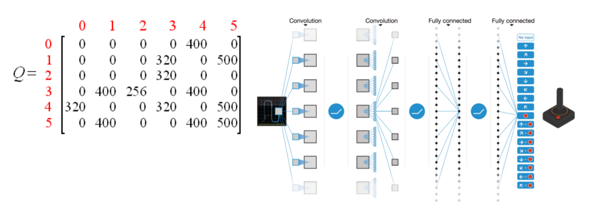
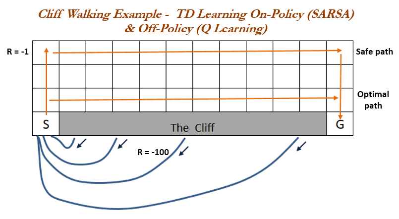
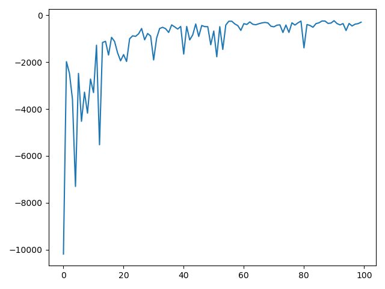

### <center>강화학습 이론 및 Q-Learning 실습 with MountainCar-v0</center>

> Author : nemo<br>2020-08-19

#### Contents

오늘은 강화학습에 관한 이론을 보고, Q-Learning에 대한 실습을 진행하고자 한다. 실습에서는 OpenAI의 gym의 MountainCar-v0환경을 이용할 것이다.

---

## 1. 강화학습

### 1.1. 강화학습이란?

Agent가 환경과의 상호작용을 통해 목표를 달성하는 방법을 찾는 문제이다.

* Agent는 환경 / 정답을 모른다.

* 적절한 Reward Function(=Value Function)을 통해 다음 행동을 결정해서 최적화를 진행한다.<br>*Reward Function은 Loss Function과 유사한 평가함수이다.*
* 미래는 현재의 정보만 가지고 추론할 수 있다.<br>*이러한 특징을 Marcov하다고 한다.*

이러한 특징을 기반으로 코딩을 잘 해서 문제를 해결하는 방법을 알아보자.

 

### 1.2. 강화학습 문제 해결의 구조

아래는 한 에피소드 동안 일어나는 일이다. 이러한 에피소드를 여러번 반복해 좋은 정책을 구해야한다. 

``` text
while ++t:

	Agent
		현재 상태 분석
		자신의 정책(Policy)에 따른 행동(Action) 선택
		Environment에게 자신의 행동 작용

	Environment
		Agent의 행동을 이용해, 현재 환경 갱신
		갱신된 환경 및 보상 반환
	
	Agent
		반환된 새로운 환경을 보고, 자기자신의 정책(Policy) 개선
```

 Agent는 환경(Environment)을 알지 못하나, 자신이 가진 정보를 통해 환경을 추측한 모델(Model)을 만들기도 한다.

 

### 1.3. Sub-Problem

1.2.를 기준으로 생각해보면,

* 현재 환경 분석 및 Action 선택
* Environment 갱신
* 현재 환경 분석 및 Policy 개선

* Agent가 환경을 추측해 모델 만들기

와 같은 문제들을 잘 해결하기 위한 함수 작성이 필요하다.


### 1.4. Policy Evaluation & Policy Imporvement

Policy는 어떻게 개선해야할까?

주로 강화학습에서 다룰 환경에서 에이전트는 모델에 대한 정보가 없다. 모델을 모르는 상태(Model-Free)에서 오프라인으로 개선하는지, 온라인으로 개선하는지에 따라 크게 Monte Carlo 방식과 Temporal Difference 방식으로 구분된다. 오프라인 방식인 Monte Carlo 방식은 편향이 적지만, 에피소드가 끝나야만 학습 가능하다는 특징이 있다.

bias-variance trade off으로 인해 둘을 섞어 쓰자는 n-step TD라는 개념도 있다. 하나의 스텝만 아닌 n개의 스텝을 보고 업데이트 하는 방식인데, n을 매우 키우면 Monte Carlo 방식이 된다.

이 글과 다음 글에서는 Temporal Difference에 기반한 방식만 다루고자 한다.

Policy는 표를 이용해 구하기도 하고, 신경망을 통한 함수 근사를 통해 구할 수도 있다.



표를 이용하는 방식에는 Sarsa와 Q-Learning등이 있으며, Q-Learning의 Q와 관련된 부분에 신경망을 붙여 함수 근사를 이용하는 기법으로 바꾼 것이 DQN이다.


이번 주에는 가장 간단한 Q-Learning을 실습해보...기 전에 Sarsa와 Q-Learning에 대해 간단히 알아보자.


##### Sarsa (On-policy)

$Q(s_{t},a_{t})=(1-learning\_rate)\cdot Q(s_t{},a_{t}) +learning\_rate(r_{t+1}+\gamma Q(s_{t+1},a_{t+1}))$

##### Q-Learning (Off-policy)

$Q(s_{t},a_{t})=(1-learning\_rate)\cdot Q(s_t{},a_{t}) +learning\_rate(r_{t+1}+\gamma max_{a}Q(s_{t+1},a_{t}))$


가장 큰 차이는 Sarsa는 직접하는 행동(Action)을 바탕으로 Policy Imporvement를 수행하는데, Q-Learning은 이전에 해본 Action을 바탕으로 구성된, 현재의 Agent가 실행해보지 않은 내용까지 이용해서 policy를 개선한다는 것이다.


사실 거의 비슷한 알고리즘이며 Q-Learning을 Sarsa-max라 부르기도 한다.

둘의 성능 차이는 행동(Action)을 선택할 때 임의성을 부여하는 $\epsilon-greedy$ 방식을 사용할 때 나타난다. 이는 $epsilon$만큼의 확률로는 정책과 관계없이 랜덤한 행동(Action)을 선택해 모험심을 강화시키는 방식이다.

사소한 차이지만, 이 경우 Sarsa는 안정성을 추구하게 되고, Q-Learning은 최적 경로를 추구하게 된다.




Q-Learning을 실습을 통해 알아보자.


## 2. 실습

MountainCar-v0 환경에서의 실습을 통해 간단한 강화학습을 구현해보자


### 2.1. Setting

환경과 구현에 알아보기에 앞서, 강화학습 환경을 위한 gym을 비롯해 다음과 같은 모듈들을 import하자.

```python
import gym
import numpy as np
import matplotlib.pyplot as plt
from tqdm.notebook import tqdm
import bisect
```


우리는 gym의 환경 중 MountainCar-v0를 사용하고자 한다.

```python
env = gym.make("MountainCar-v0")
env.reset() # state를 반환
```


### 2.2. Environment

MountainCar-v0의 환경에 대해 알아보자. PyCharm의 디버깅 기능을 통해, 만들어진 env 객체를 확인하는 것도 도움이 된다.


#### 2.2.1. observation_space

>Type: Box(2)

|Num|Observation|Min|Max|
|------|---|---|---|
|0|position|-1.2|0.6|
|1|velocity|-0.07|0.07|

`observation_space.low[0]`과 같은 명령어로 확인할 수 있다.


#### 2.2.2. action_space

> Type: Discrete(3)

0이면 왼쪽으로 밀기, 1은 힘을 가하지 않기, 2는 오른쪽으로 밀기를 의미한다.


#### 2.2.3. Episode 종료

gym에서 episode는 종료 state에 도달하거나, 일정 횟수만큼 step()을 실행하면 끝난다.

MountainCar-v0의 `env._max_episode_steps`는 기본적으로 200으로 세팅되어 있는데, 이는 200번째 step 이후에는 실패했더라도 에피소드를 종료시킨다는 뜻이다. 학습되지 않은 상태에서는 200번만으로는 성공할 수 없기 때문에 `_max_episode_step`을 적당히 큰 수만큼 늘려주자

```python
env._max_episode_steps = 100000
```


### 2.3. Implement

`MountainCar-v0` `action_space`는 0, 1, 2로 원래 잘 이산화되어 있지만, `observation_space`는 연속적이기 때문에 Q-Learning을 사용하기 위해서는 이산화된 구간으로 나누어야한다.

`observation_space`는 위치와 속도로 이루어져 있다. 위치의 범위는 -1.2부터 0.6 까지이며, 속도의 범위는 -0.07부터 0.07까지이다. Q-Learning을 위해 환경을 이산적으로 표현하자. 각 위치가 속한 구간 길이는 0.1로 하고, 속도에 대한 구간의 길이는 0.01로 하자.  

아래의 코드를 실행시키면 `pos_space`는 19차원으로, vel_space는 15차원으로 구간의 끝 점을 포함하게 잘 나누어짐을 확인할 수 있다.

```python
pos_space = np.arange(env.observation_space.low[0], env.observation_space.high[0], 0.1)
vel_space = np.arange(env.observation_space.low[1], env.observation_space.high[1], 0.01)
```


연속적인 값을 주면, 이산화된 인덱스를 반환하는 `get_state`함수를 작성하였다.

구현 원리는 다음과 같다.

 `value`의 `lower_bound`에 대응하는 인덱스를 이분탐색으로 짚으면 그 이전 인덱스는 `value`보다 작은 값이 되는데, 각각에 대한 L1 norm을 측정하여 더 가까운 space의 인덱스를 `state`으로 반환한다. 

```python
def get_state(name, value):

    if name == "pos":

        ret = bisect.bisect_left(pos_space, value - 1e-5)
        if ret > 0 and pos_space[ret] - value > value - pos_space[ret-1]:
            ret -= 1
        return ret

    if name == "vel":

        ret = bisect.bisect_left(vel_space, value - 1e-5)
        if ret > 0 and vel_space[ret] - value > value - vel_space[ret-1]:
            ret -= 1
        return ret

    return -1
```


Q-Learning 동작에 따라 열심히 구현하자.

```python
def train(env, episodes, epsilon=0.8, min_epsilon=0.01, learning_rate=0.2, gamma=0.9, show=False):

    Q = np.zeros((len(pos_space), len(vel_space), env.action_space.n))
    reward_history = []

    for episode in tqdm(range(episodes)):

        state = env.reset()

        pos = get_state("pos", state[0])
        vel = get_state("vel", state[1])
        reward = 0

        while True:

            # next action 고르기
            if np.random.random() < 1 - epsilon:
                action = Q[pos, vel].argmax()  # action_space
            else:
                action = np.random.randint(0, env.action_space.n)

            # 환경에 가하기
            state_next, reward_step, tr, _ = env.step(action)

            pos_next = get_state("pos", state_next[0])  # index
            vel_next = get_state("vel", state_next[1])  # index
            reward += reward_step

            if tr == True and state_next[0] >= 0.5:
                Q[pos, vel, action] = reward_step
                break

            Q[pos, vel, action] = (1 - learning_rate) * Q[pos, vel, action] + learning_rate * (reward_step + gamma * np.max(Q[pos_next, vel_next]))

            if tr == True:
                break

            pos, vel = pos_next, vel_next

        epsilon = max(min_epsilon, epsilon - 2 * (epsilon / episodes))
        reward_history.append(reward)

        if episode % 100 == 99 and show == True:
            print('episode : ', episode, ', reward : ', reward, ', epsilon : ', epsilon)

    return Q, reward_history
```


학습을 해보고, 잘 되었는지 매 학습에서 받은 보상에 대한 기록(`reward_history`)을 출력해보자

학습이 완료될 때 즈음에는 약 500번 내외의 횟수로 목표 지점에 도착함을 확인할 수 있다.

```python
Q, reward_history = train(env, 100)
print(reward_history)
plt.plot(reward_history)
plt.show()
```





끝으로 `env.render()`를 이용해서 학습의 결과물을 보여주는 함수를 작성하자.

```python
def rendering(env, Q, epsilon=0.01):

    state = env.reset()
    pos = get_state("pos", state[0])
    vel = get_state("vel", state[1])

    while True:

        if np.random.random() < 1 - epsilon:
            action = Q[pos, vel].argmax()  # action_space
        else:
            action = np.random.randint(0, env.action_space.n)

        # 환경에 가하기
        state_next, reward_step, tr, _ = env.step(action)
        env.render()

        pos_next = get_state("pos", state_next[0])  # index
        vel_next = get_state("vel", state_next[1])  # index

        if tr == True:
            break

        pos, vel = pos_next, vel_next
```


결과는 직접 확인해보자

```python
rendering(env, Q)
```

---

#### Reference

[1] [Q-Learning 위키]([https://ko.wikipedia.org/wiki/Q_%EB%9F%AC%EB%8B%9D](https://ko.wikipedia.org/wiki/Q_러닝))<br>[2] [Q-Learning](https://gist.github.com/gkhayes/3d154e0505e31d6367be22ed3da2e955)<br>[3] [Q-Learning 강의자료](https://bi.snu.ac.kr/Courses/ML2017/Ch8_DRL.pdf)<br>[4] [Sarsa VS Q-Learning](https://subscription.packtpub.com/book/data/9781789345803/1/ch01lvl1sec13/sarsa-versus-q-learning-on-policy-or-off)